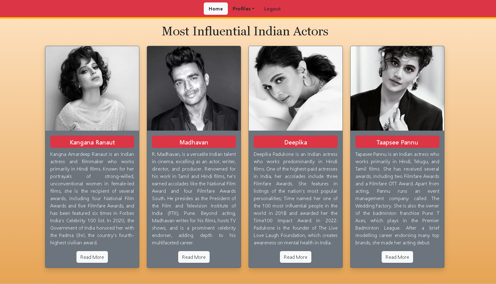
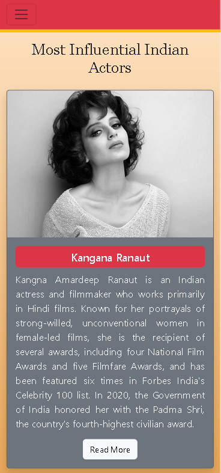
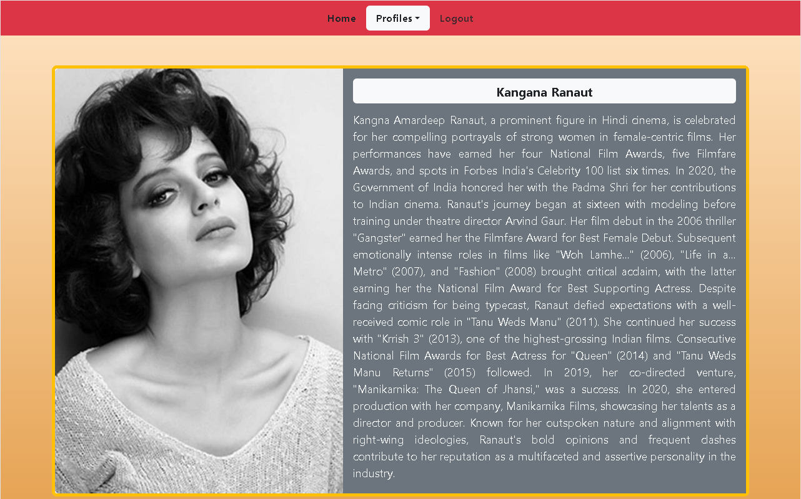
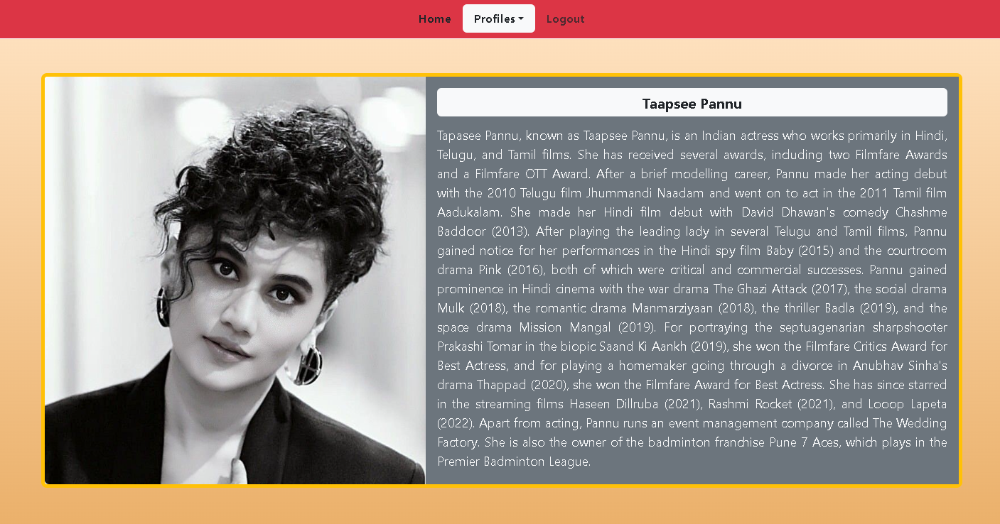

# Most Influential Indian Actors

## Introduction

The goal of this project is to create fully responsive webpages featuring a navigation bar, cards, and details pages using Bootstrap, a powerful front-end framework. The project leverages the classes, features, and utilities offered by Bootstrap to create webpages that seamlessly adapt to various screen sizes whether accessed on a laptop, desktop, tablet, or a phone without compromising on the functional or visual appeal. 

## Features

- Navigation bar with options for Home, Profiles, and Logout.
- Dropdown menu under Profiles for easy access to individual profiles.
- Responsive cards layout for displaying actor profiles.
- Details pages for each actor, containing more information in a card format.
- Utilization of Bootstrap's grid system for responsive design.

## Installation

No installation required. Simply open the HTML files in a web browser to view the project.

## Usage

1. Clone or download the repository to your local machine.
2. Open the HTML files in a web browser to navigate through the webpages.
3. Click on the navigation links to explore different sections of the website.

## Screenshots

  

  

  

  

  

## License

This project is not licensed.

## Additional Information

- Bootstrap version used: 5.3.2
- Additional CSS styles are defined in `styles.css`.
- Images for actor profiles are stored in the `images` directory.

  For any questions or further information, please contact [nknithi2018@gmail.com](mailto:nknithi2018@gmail.com).
